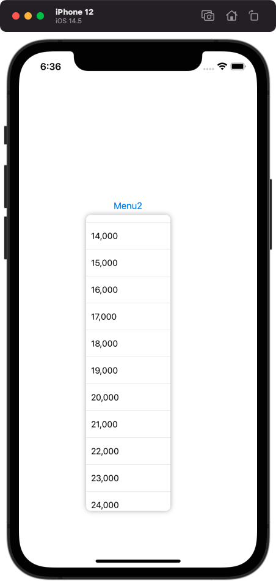

# SPMenu

[](https://travis-ci.org/comcxx11/SPMenu)
[](https://cocoapods.org/pods/SPMenu)
[](https://cocoapods.org/pods/SPMenu)
[](https://cocoapods.org/pods/SPMenu)

## Example



To run the example project, clone the repo, and run `pod install` from the Example directory first.

## Requirements

## Installation

SPMenu is available through [CocoaPods](https://cocoapods.org). To install
it, simply add the following line to your Podfile:

```ruby
pod 'SPMenu'
```

## Author

comcxx11, comcxx11@gmail.com

## License

SPMenu is available under the MIT license. See the LICENSE file for more info.
